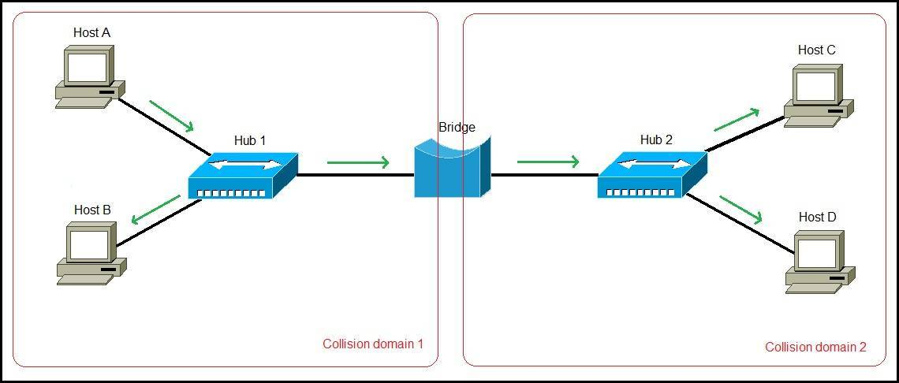
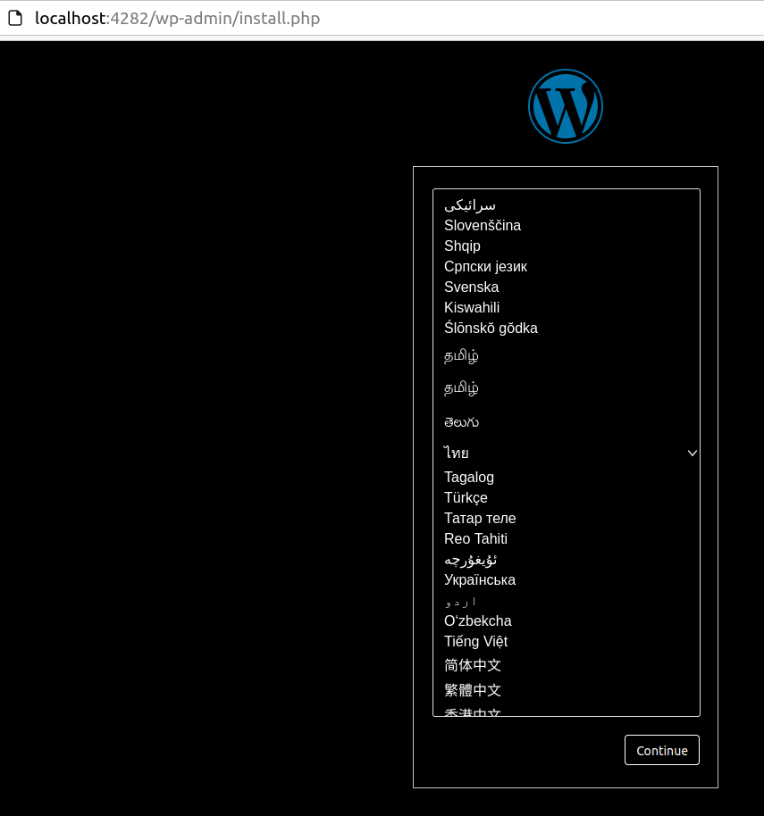
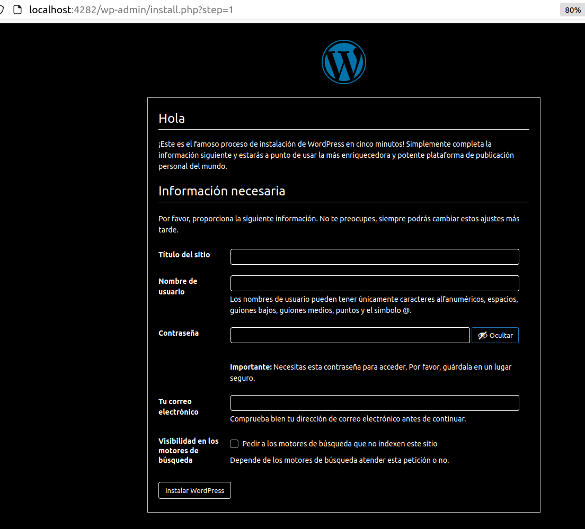
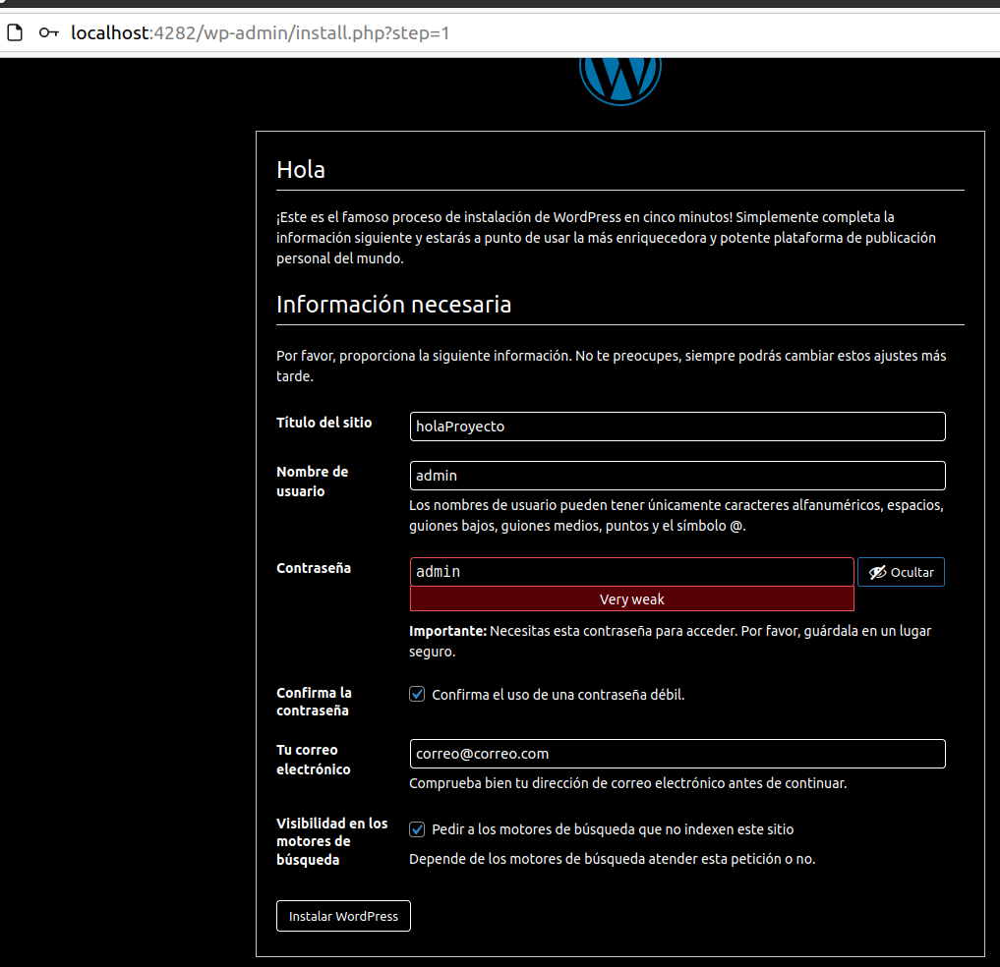
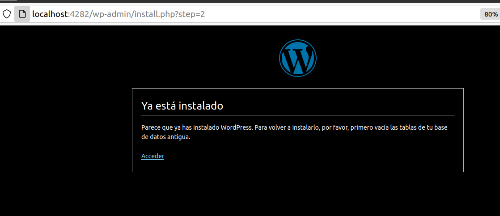
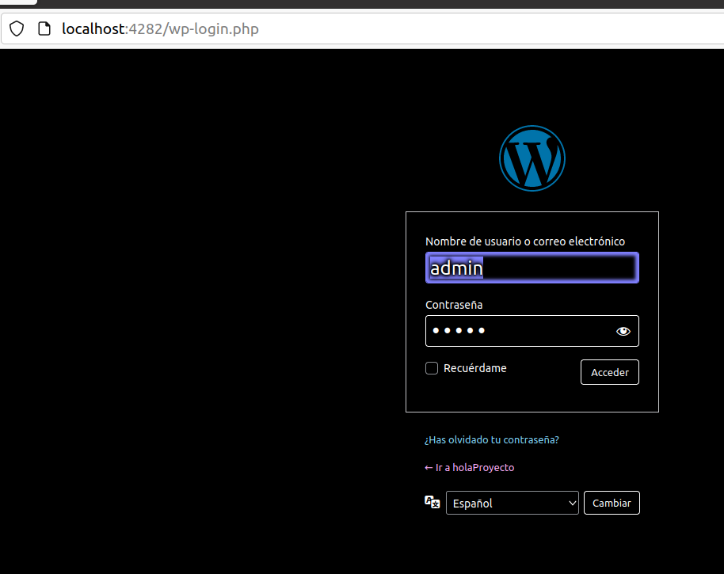
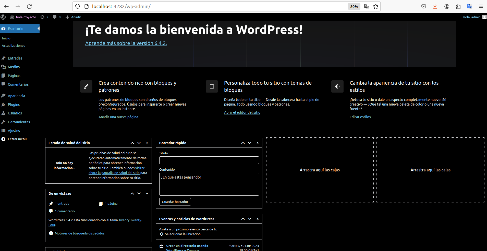
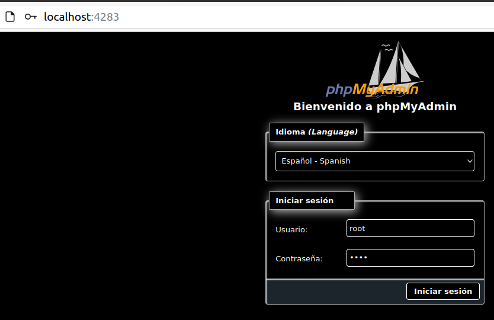
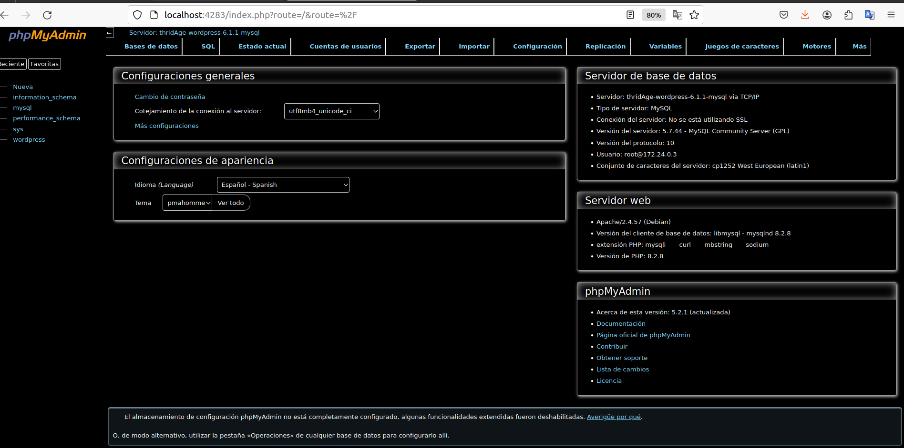
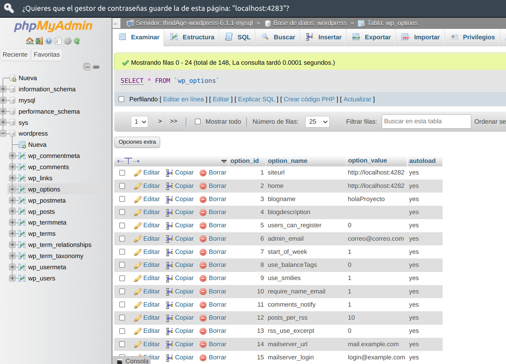

[](https://code.visualstudio.com/)
[](http://ansicolortags.readthedocs.io/?badge=latest)
[](https://github.com/Naereen/badges/)

# LEvantando solo contenedor imagen con wordpress, php, mysql

- ## (OJO. DOCKER crea los directorios desde la definicion en docker compose)

### Docker Compose:

- Nos permite interconectar varios contenedores que esten en la misma red, esto es, podemos instalar un CONTENEDOR de:

  - MYSQL:
  - WORDPRESS: Que incluye el servidor web, interprete de php
  - PHPMYADMIN:

Y tenerlos interconectados unos con otros, todo esto gracias a docker compose

- La información dentro de un contenedor se pierde cuando este deja de ejecutarse, por eso creamos volúmenes.

### Bridge o Puente de red

- Interconecta segmentos de una red LAN o (divide una red en segmentos),filtrando los los paquetes para que pueden transferir de una red a otra según la dirección física MAC del destino de cada paquete (IP dirección lógica). El bridge conecta segmentos de red formando una sola subred (permite conexion entre equipos sin necesidad de router), funciona a travez de una tabla de direcciones MAC detectadas en casa segmento al que se conecta. Cuando detecta que un nodo de un segmento de uno de sus segmentos está intentando transmitir datos a un nodo de otro segmento de red, el BRIDGE copia la trama para el otro segmento de red teniendo la capacidad de desechar la trama (filtrado) en caso de no tener dicho segmento de red como destino.

- `Fig 1` : Bridge conectando 2 segmentos de red
  

### Recordar !

- Para levantar docker compose usamos el comando:
  ```
  sudo systemctl start docker o systemctl start docker
  ```
- Para crear el contenedor a partir del fichero:
  ```
  docker-compose up -d
  ```
- Para levantar worpress server:

  ```
  http://localhost:4282/
  ```

  - Respuesta del server al cliente, formulario de configuración Idioma:
    

  - Formulario configuración proyecto:
    
    
    
    
    
    
    
    Introduce la contraseña root y la contraseña que hayas asignado en las variables de entorno, en nuestro caso 1234: ` MYSQL_ROOT_PASSWORD: 1234`

    
    
    


