

# Creación de proyecto en wordpress

## Instalar temas
    - Seleccionar -> Appearance -> Themes -> Add New Theme.
    - Buscamos nombre de theme escribibiendo en input "Search theme"   

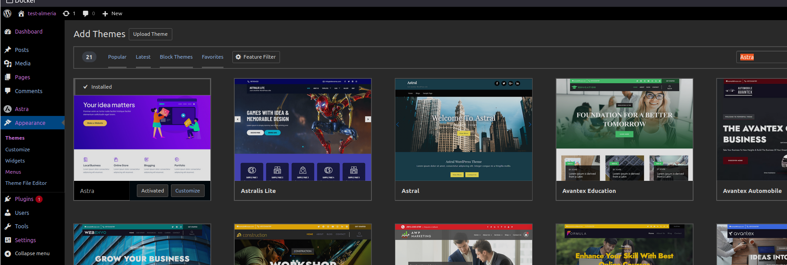

    - Hemos elejido el theme "Astras"
    - Seleccionar: Install -> Activate -> Customice -> publicate 

## Instalando plugin
En este caso el plugin quitará todos los anuncios banners de la vista "Astra Customizer Reset "
    - Plugins -> Add New Pluggin 

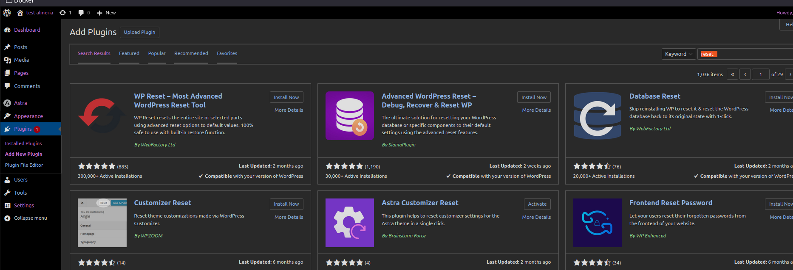

    - Install Now -> Activate 

## Eliminado las páginas 
Por defecto, antes de crear las páginas propias de la wed, debemos eliminar las páginas que se auto-crearon cuando creamos el nuevo proyecto 
    - Pages -> Seleccionarmos una por una (todas)  

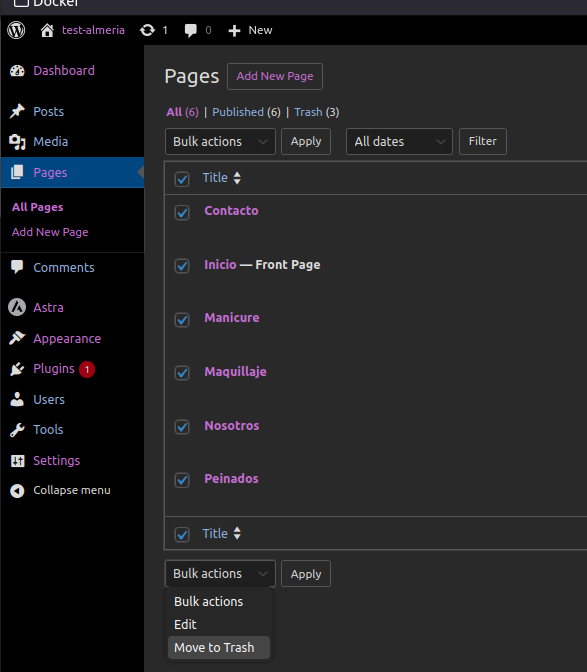

    - Seleccionamos MOve to trash

## Creación de nuevas páginas
Creación de nuevas páginas, estás serán las que sean navegables desde nuestro sitio web:
    - Pages -> Add New Pages

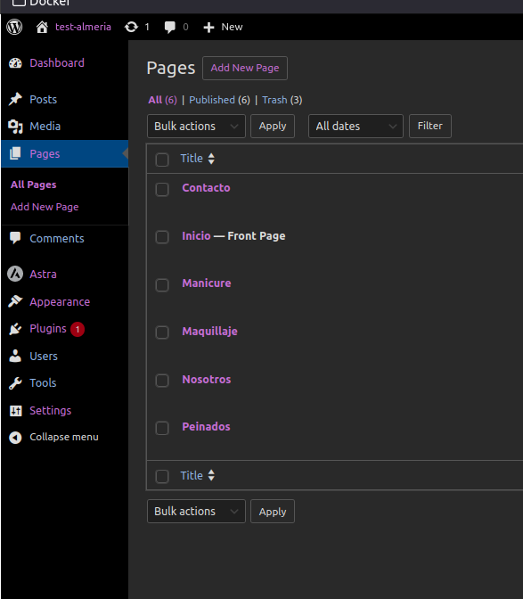

    - Completar con el nombtre en Add title "seccion-A"-> publish (2 veces)

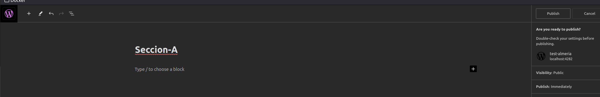
    
### Crear menú de navegación
Creación de menú y sub  menú d enavegacion con las secciones de servicios de la web, navegables a otras vistas. Este memú se creará luego de la creación de nuevas páginas, toma esta entrada. 
 
    - Appearence -> Menus -> "completar en" Menu Name 

Seleccionar en que zonas de la web se verá este menú. 

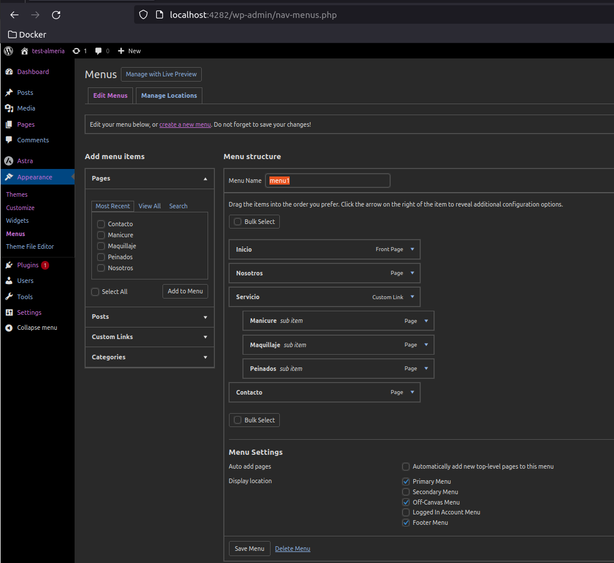

    - Create Menu  

### Posible error!!
Si obtenemos un doble inicio, configuramos para que solo sea uno  

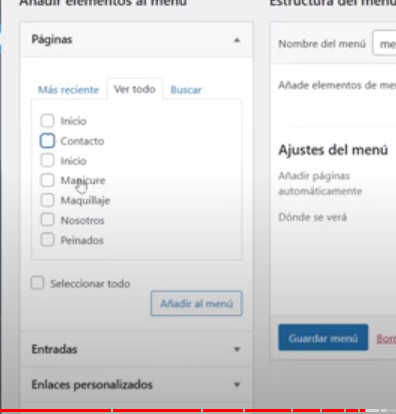

Navegamos a:
    - setting -> reading
    Esto con el objetivo de definir una sola página de inicio cuando navego al home

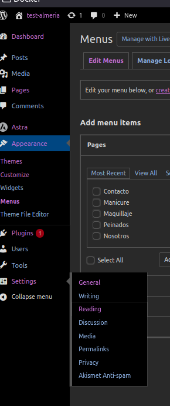

Seleccionamos en: A static page (select below) , Homepage (inicio) 

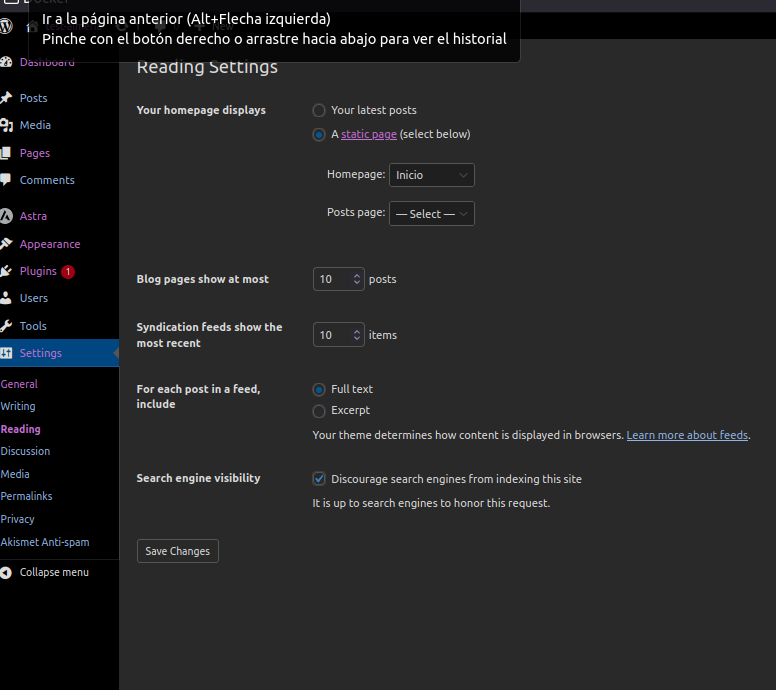

### Navegamos a Appearance
Allí seleccionamos las páginas que queremos que esten en nuestro menú. -> Guardad menú.

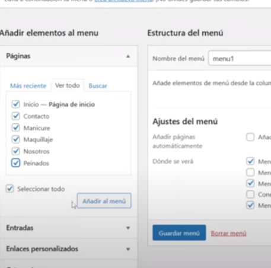

Luego podremos arrastrar los menus (cajas) unos sobre otros para ornaizar la posición de paginas. Luego de moverlas, gurdamos los cambios. Se pueden anidar las páginas como hermanas o hijas

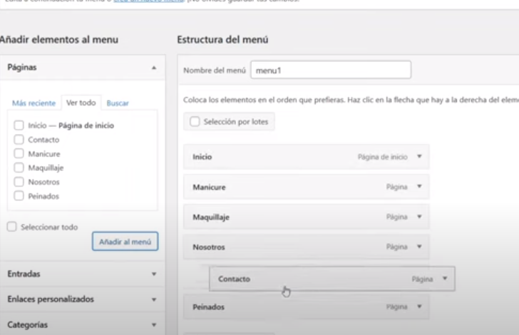

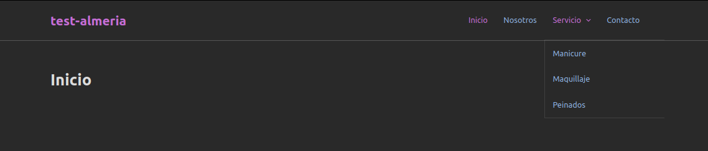

